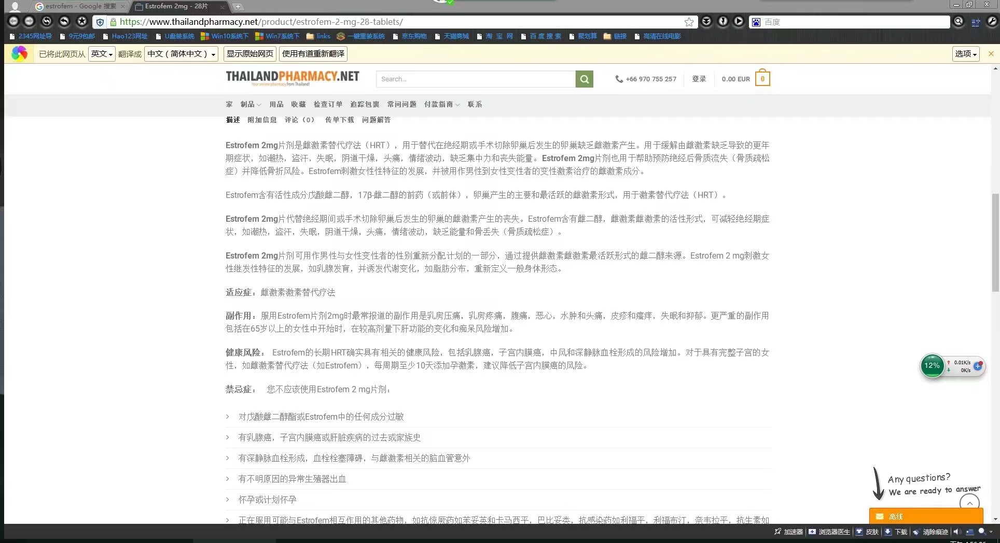
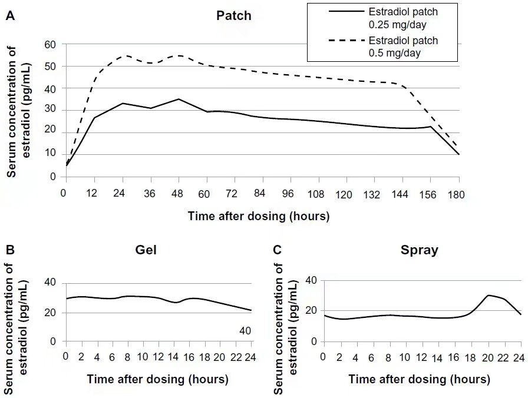
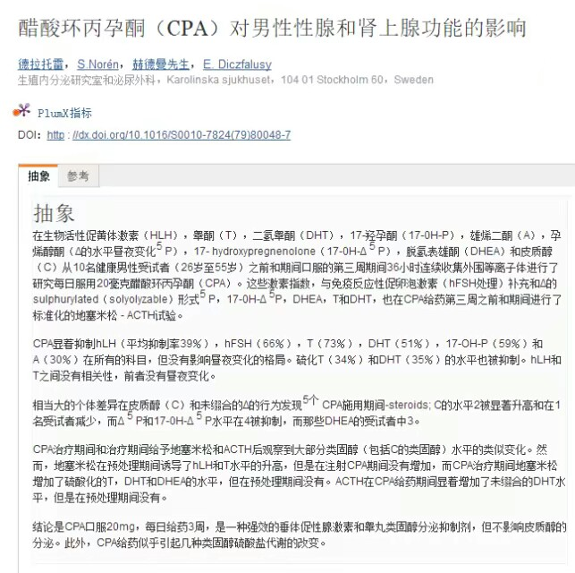
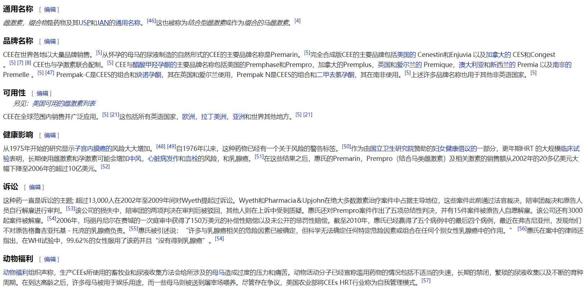

# 激素

该目录收录与跨性别者在激素治疗相关的医疗资源和经验分享，包括各种激素使用的指南、研究、患者故事等。适合希望了解激素治疗过程的跨性别者及其支持者，提供科学数据与真实经历的交融。

### 📁 子目录

- [雌二醇凝胶自制方法](雌二醇凝胶自制方法) (4 篇内容)

### 📄 文档

- [001_JMIS_march_EDITORLETTER](001_JMIS_march_EDITORLETTER_page.md)
- [00194562](00194562_page.md)
- [5000012290-5000020606-1-PB](5000012290-5000020606-1-PB_page.md)
- [ce7f496e06922be8dcfa9193fd0333f60290](ce7f496e06922be8dcfa9193fd0333f60290_page.md)
- [hormones_MTF](hormones_MTF_page.md)
- [性激素与免疫系统关系的研究进展](性激素与免疫系统关系的研究进展_page.md)
- [性激素免疫调节效应与疾病发生的关系](性激素免疫调节效应与疾病发生的关系_page.md)
- [性激素对创伤-失血性休克后机体免疫功能的影响](性激素对创伤-失血性休克后机体免疫功能的影响_page.md)
- [性激素对机体免疫系统功能的影响](性激素对机体免疫系统功能的影响_page.md)
- [报道1](报道1_page.md)

### 🖼️ 图片

[1526426092294](1526426092294.png)

[1526426111749](1526426111749.png)

[1526426113788](1526426113788.png)

[1526426115999](1526426115999.jpeg)

[1526426121029](1526426121029.jpeg)

[1526426127004](1526426127004.jpeg)

[1526426154814](1526426154814.jpeg)

[1526426157939](1526426157939.png)

[1526426162001](1526426162001.png)

[1526426172695](1526426172695.png)

[1526426175586](1526426175586.jpeg)

[1526426181859](1526426181859.png)

[1526426186219](1526426186219.png)

[1526426196175](1526426196175.jpeg)

[1526427703899](1526427703899.jpeg)

[1526427706959](1526427706959.jpeg)

[1526427710811](1526427710811.png)

[1526427715724](1526427715724.jpeg)

[1526427718296](1526427718296.jpeg)

[1526427723238](1526427723238.jpeg)

[1526427728034](1526427728034.png)

[1526427732850](1526427732850.png)

[1526427740542](1526427740542.png)

[1526427742516](1526427742516.png)

[1526427745255](1526427745255.jpeg)

[1526427745863](1526427745863.jpeg)

[1526427754883](1526427754883.jpeg)

[1526427759136](1526427759136.jpeg)

[1526427759992](1526427759992.jpeg)

[1526427762624](1526427762624.jpeg)

[1526427769871](1526427769871.jpeg)

[1526427772589](1526427772589.jpeg)

[1526427775284](1526427775284.jpeg)

[1526427784635](1526427784635.png)

[1526427787316](1526427787316.jpeg)

[1526427808478](1526427808478.png)

[1526427810918](1526427810918.png)

[1526427814685](1526427814685.jpeg)

[1526427816985](1526427816985.png)

[1526427819787](1526427819787.png)

[1526427822404](1526427822404.jpeg)

[1526427824640](1526427824640.png)

[1526427827672](1526427827672.png)

[1526427833528](1526427833528.png)

[1526427836274](1526427836274.jpeg)

[1526483860457](1526483860457.png)

[1526483913565](1526483913565.png)

[1526483916423](1526483916423.png)

[1526483920787](1526483920787.png)

[1526483925359](1526483925359.png)

[1526483954945](1526483954945.png)

[1526484057156](1526484057156.png)

> 本内容为自动生成，请修改 .github/ 目录下的对应脚本或者模板
